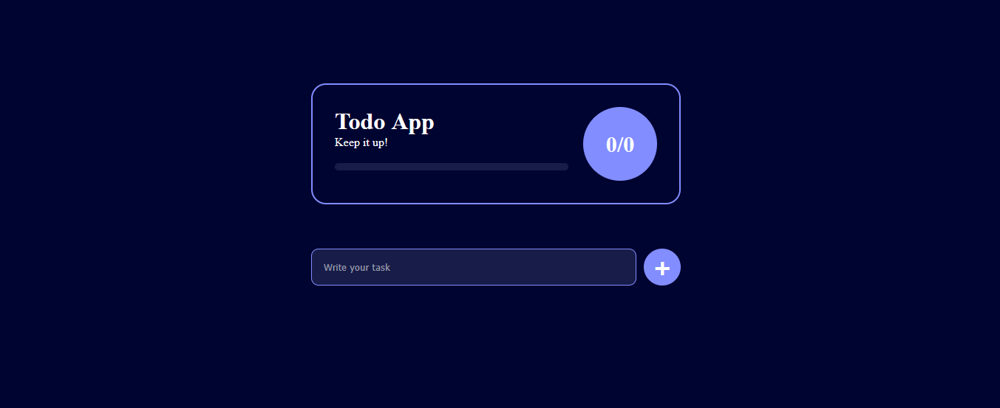

📝 Todo App

A simple and elegant Todo List Application with a modern user interface.
It helps you organize tasks, mark them as complete, and track your overall progress easily.

✨ Features

➕ Add new tasks

✅ Mark tasks as complete

❌ Delete tasks

📊 Progress tracker with progress bar

🎨 Clean and responsive UI

🚀 Tech Stack

HTML – Structure

CSS – Styling and animations

JavaScript – App logic and interactivity

🔧 Installation & Setup

Clone the repository

git clone https://github.com/jettysuvarna/todo-app.git

Navigate to the project folder

cd todo-app

Open index.html in your browser

📷 Application Interface

